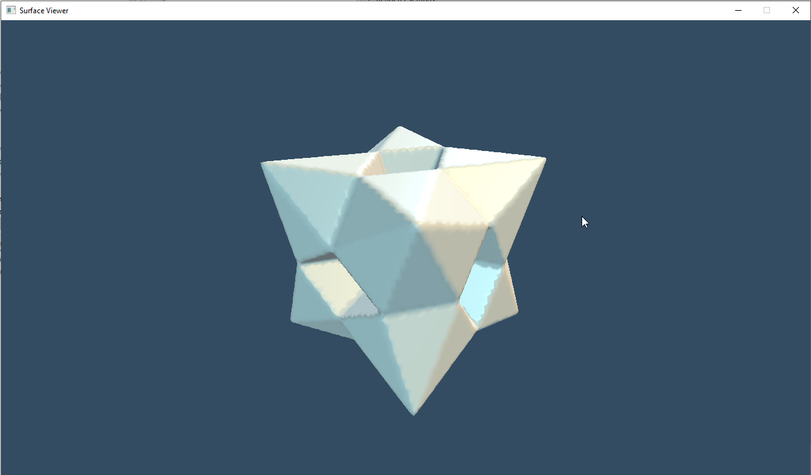
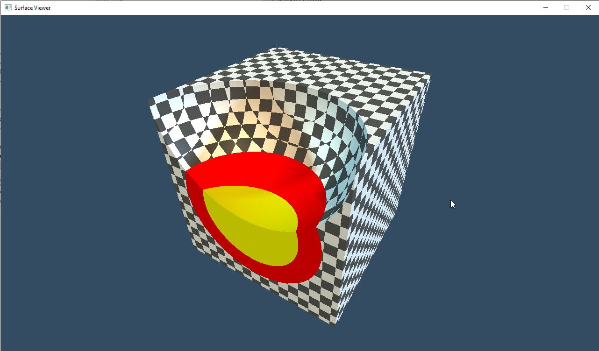

# Surface Viewer application

_BSc thesis assignment project of Kovács Botond János, 2020_

## Requirements

* Java 11 JDK (Tested using https://adoptopenjdk.net/[AdoptOpenJDK 11])
* _Windows 10_ or _Linux_, capable of running `gradlew` or `gradlew.bat`
* A _command prompt window_ or _shell access_

## Building

The application is built using `Gradle`. Thanks to the `gradlew` scripts, Gradle is installed locally in the project when it is first invoked. To compile the source code, run `gradlew build`.

## Running

Currently the only reliable way to run the application is via executing `gradlew run`. Alternatively, if the project is imported into _IntelliJ IDEA_, the `me.bokov.bsc.surfaceviewer.run.FXEditorMain` class can be used as the entrypoint.

## Examples

There are many example scenes in the `example` directory, that can be opened by the application.

## Screenshots

.The editor when opening a scene. On the right side, different functions of the editor will be available on different tabs. On the first tab (Renderer settings), you can change the renderer to the ray marcher, or change the voxelization and mesh generation parameters of the default fixed function pipeline renderer.

.You can change the SurfaceLang code of the scene on the Code editor tab. By clicking the Sync button, you can synchronize changes done outside the code editor, and by clicking Compile, or pressing Ctrl+Enter, you can compile the code currently in the editor.

.By chosing the Edit option in the context menu of a tree node in the scene browser on the left, you can open the scene node editor tab for a given scene node. In this editor tab, you can set the transformation properties, and the surface generator's properties associated with the given node.

.You can interact with the scene nodes in the left part of the editor window, the Scene Browser. This component displays the scene in a tree, supports drag n' drop between different nodes, and the right click context menu.

.You may save the current scene, open an existing, export it as a 3D model file, or make a higher resolution render of it using the File menu.

.The render dialog.
image::./screenshots/editor-6.png[]

.The export dialog.

.A scene, displayed using the fixed function mesh rendering pipeline.

.A scene, displayed using the realtime ray marcher.
